熊猫数据分析工作室 ([English Version](README_en.md))
=================

熊猫数据分析工作室由从事多年的数据统计分析、计算机科学、工程应用的专家组成的团队。

在商务智能、智能定位、医疗数据分析、振动数据分析方面尤为擅长。
主要的技术特长包括：

1. 大数据Hadoop生态系统， 包括：Apache Drill, Hive
2. 采用Python、R、SAS、Matlab等进行统计分析和数据挖掘
3. 采用Tableau, QlikView, ArcGIS or Open source GIS 进行数据的可视化
4. 传统的面向关系型数据、时空数据库、时序数据库等构建经验
5. 对分布式计算框架Mesos、Spark、Storm均有工程经验
6. 在工业领域如直升机的振动监测、故障诊断，航空设备的健康预测phm等均有一定的研究

我工作室是专门为科研单位和公司提供数据分析服务支持的团队， 团队提供如软件开发、数据质量控制、统计分析方法、机器学习算法、数据可视化、ETL、数据库和数据仓库开发、高性能分布式集群搭建与应用的技术支持和顾问。

|    |    |
| -------------------------------------|:----------------------------------------:| 
| 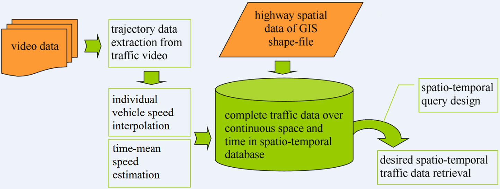| 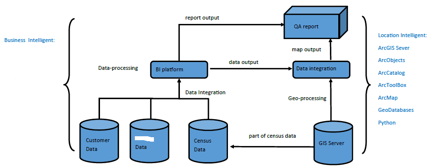    | 
| 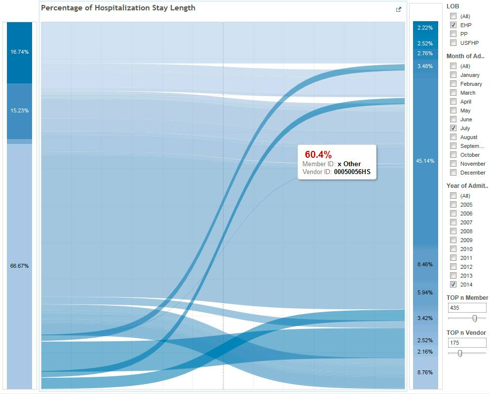          | 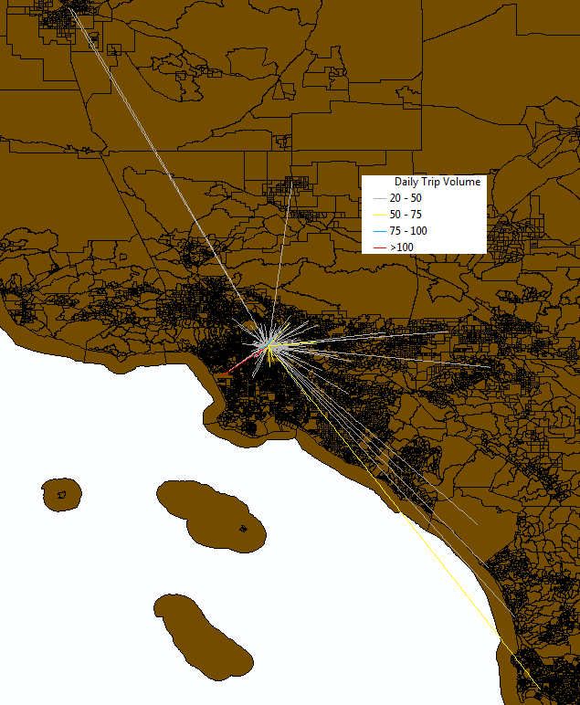               |
| 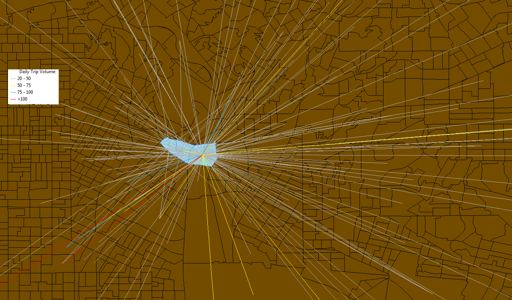           | 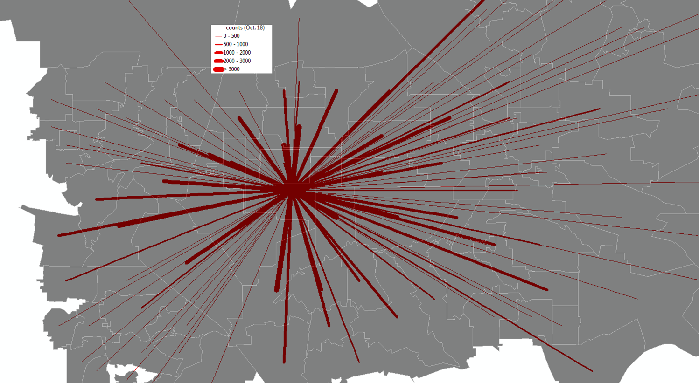                 |
| 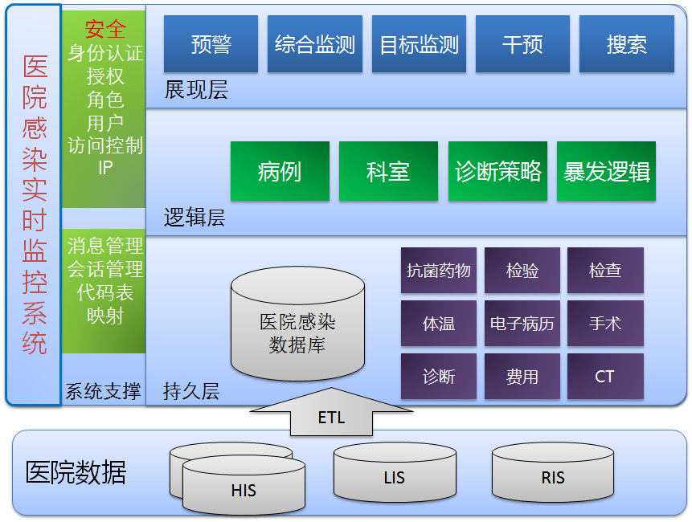            | 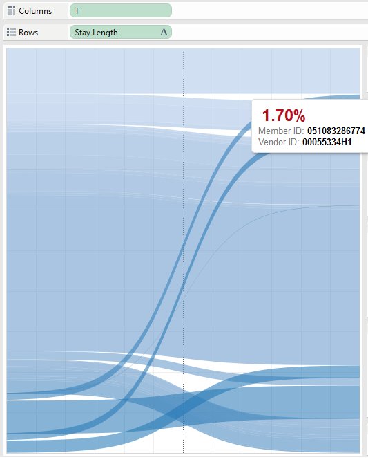                 |
| 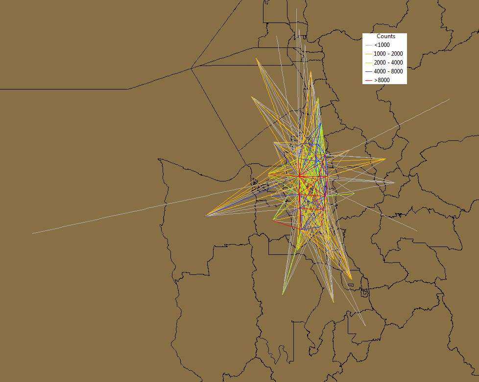               | 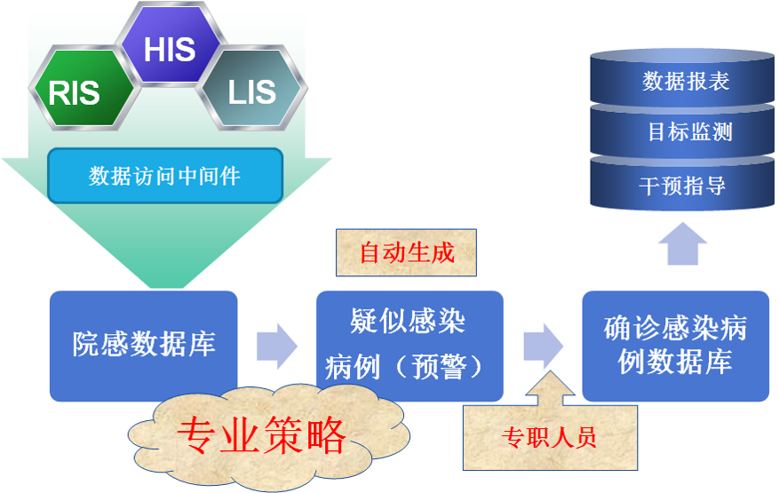               |
| 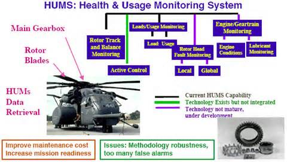       | 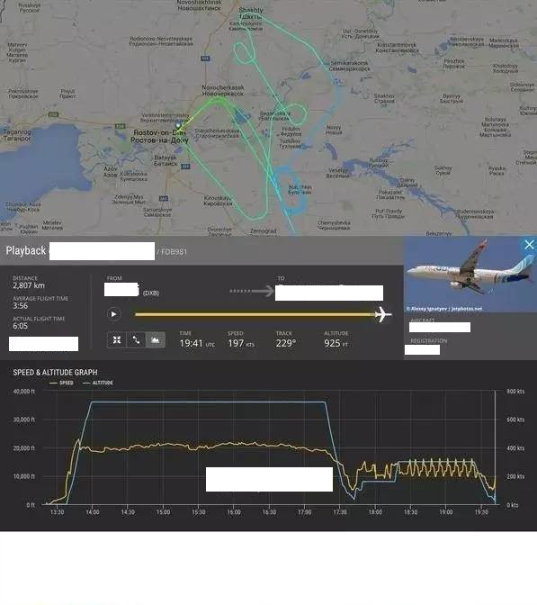|

Reference: http://dblp.uni-trier.de/pers/hd/y/Yue:Hang
