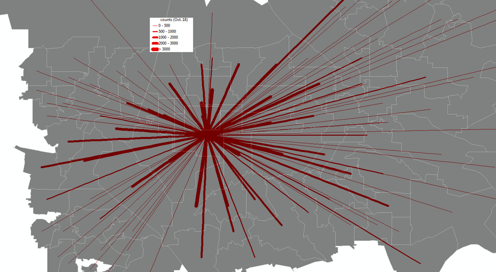
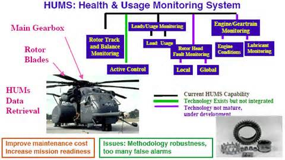

# Panda Data Science Studio （[中文版](README.md))

Our Panda Data Science Studio consists of some professionals with multi-disciplines in statistics, computer science, engineering, etc.

We are good at business intelligence and location intelligence: 

1. Big data Hadoop Ecosystem including Apache Drill, Hive
2. Statistical method and data mining using Python、R、SAS、Matlab,vc#, Java, c，cpp,Scala, Haskell、golang
3. Data visualization using Tableau, QlikView, ArcGIS or Open source GIS
4. Database design and software development using Java, C++, SQL
5. Experience on Mesos、Spark、Storm、CUDA、MachineLearning
6. Experience on helicopter health and diagnostic, PHM etc.

We can offer professional services for your data analytics in academic research or software development in business, such as data quality control, statistical analysis method, machine learning algorithm, data visualization, ETL, database or data warehouse development, software programming, website development, etc. 

(note: our service can improve the quality of your thesis or dissertation and save your graduation time, solve your coding problems and tough data analysis issues)

|    |    |
| -------------------------------------|:----------------------------------------:| 
| |     | 
|           |                |
|            |                  |
|             |                  |
|                |                |
|        | |

Reference: http://dblp.uni-trier.de/pers/hd/y/Yue:Hang

